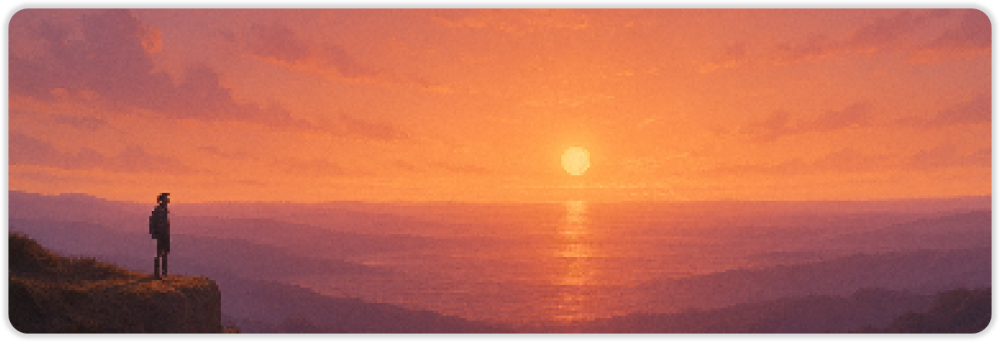

<!-- Banner -->

  

<h3 align="center">Luis Postigo</h3>

  <em>Software engineer · engineering autonomy for complex systems</em>

  <a href="https://luispostigo.github.io/">luispostigo.github.io</a>

---

### About me
- B.S. Aerospace Engineering · B.S. (in-progress) Software Engineering  
- Researching thermochromic particles for space-debris mitigation  
- Favorite tools: `PyTorch`, `TensorFlow`, `C++/Eigen`, `RabbitMQ`, `React`

### Tech stack

  
  
  
  
  
  
  
  

### Pinned Projects
| Repo | What it is |
|------|------------|
| **Portfol.io** | Multi-agent system that scores dev portfolios using local LLMs & RabbitMQ |
| **ThermoDust** | FEM + Mie-theory model for thermochromic space dust trajectories |
| **TagIt** | AI-powered inventory app using QR codes & image retrieval |
| **OpticalKit** | Fast C++ optical-property solver with Python bindings |